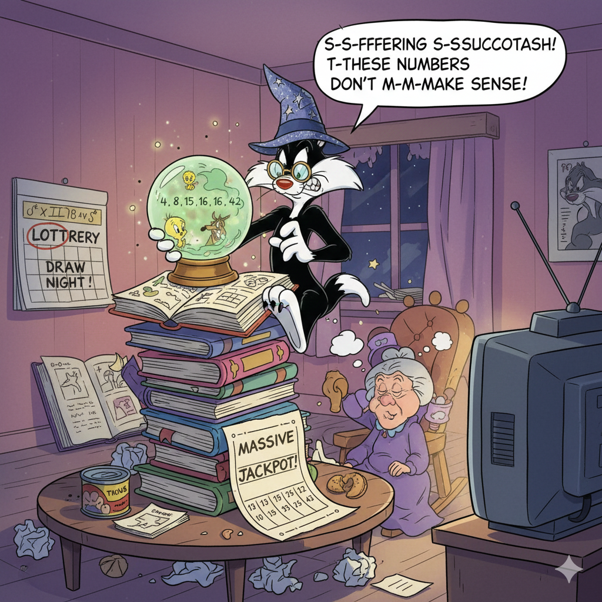

<p align="center">
  
</p>

---

# Lottery

Here is a repository to estimate random draws. It concerns **[FDJ](https://www.fdj.fr/)** with *Euromillions*, *Loto* and *Eurodreams* games.

Even if AI-model could be used on historical one-hot encoded data, no estimator could really predict the next draw of a lottery game.

## Get and update datasets

Copy and udpate each dataset file from each game in corresponding folders. Related path are displayed in each *data_building.py* script of **euromillions**, **loto** and **eurodreams** folders.

```python
root_path = ... # target path for corresponding dataset folder
```

- **Euromillions**: [Datasets](https://www.fdj.fr/jeux-de-tirage/euromillions-my-million/historique)

- **Loto**: [Datasets](https://www.fdj.fr/jeux-de-tirage/loto/historique)

- **Eurodreams**: [Datasets](https://www.fdj.fr/jeux-de-tirage/eurodreams/historique)

## Estimate random next draws

Run the *main.py* script to predict the next draw for the different games.

## Disclamer

Participation in money games or any form of gambling can be highly risky. It is essential to understand that these activities may lead to significant financial losses. Please be aware of financial risks, addiction risks and legal issues.

The author does not take any responsibility for any financial loss, damages, or any other negative consequences that may arise from using this code. 

Remember to be cautious with your money and behavior when participating in any financial activity.
